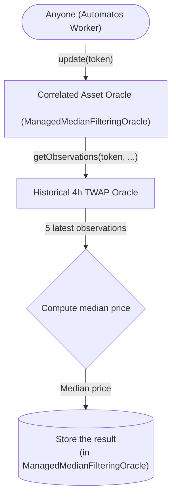

import { Callout } from 'nextra/components';

# Correlated Asset Oracle

## Purpose

Correlated Asset Oracles are particularly crucial for assets like stablecoins and liquid staking tokens, which often have underlying assets backing them. In such cases, spot price oracles might not always offer the most accurate valuations due to the inherent stability or backing mechanisms of these assets. For example, during depeg events, where assets like DAI, USDC, or ezETH temporarily deviate from their intended peg, spot prices can mislead, resulting in unjust liquidations and other financial consequences.

To address this issue, Correlated Asset Oracles provide a simple yet effective layer of security. By requiring price deviations to persist over longer periods before adjusting the reported prices, these oracles help ensure that temporary fluctuations do not lead to premature or unwarranted actions. This approach not only reduces the risk of unjust liquidations but also enhances the overall stability and reliability of the system, particularly for assets that are highly correlated or have strong backing.

## Motivation

The evolution of asset pricing strategies in decentralized finance (DeFi) has been shaped by significant events that exposed vulnerabilities in existing systems. One such event was the Compound DAI liquidation event in November 2020, which highlighted the challenges of relying on real-time market prices for pegged assets during periods of temporary volatility.

During this event, DAI—a stablecoin pegged to the US dollar—experienced a temporary depeg that lasted for about three hours. Despite the short duration of this depeg, the sudden drop in DAI's price triggered a wave of liquidations on the Compound protocol. These liquidations were largely seen as unjust, as the depeg was not a reflection of a fundamental change in DAI's value but rather a temporary market anomaly. The financial losses and instability caused by this event led to a re-evaluation of the pricing mechanisms used in DeFi protocols.

In response to such incidents, many protocols adopted fixed-price oracles for assets like stablecoins. Fixed-price oracles mitigate the risk of unjust liquidations by maintaining a stable, predefined price for an asset, irrespective of short-term market fluctuations. This approach is particularly effective in preventing liquidations during temporary depegs, as it resists reacting to momentary price changes that do not reflect the asset's true value.

However, while fixed-price oracles offer a layer of protection against temporary volatility, they come with significant limitations. One of the most critical drawbacks is their inability to respond automatically to legitimate, sustained changes in an asset's value, known as debasements. When an asset undergoes a true market shift—like a prolonged decrease in value—fixed-price oracles require manual intervention to adjust the reported price. This reliance on human decision-making introduces delays and the potential for bad debt to accumulate, as the protocol continues to operate based on an outdated and inaccurate asset valuation.

For example, during the collapse of Terra USD (UST), the price dropped from $0.995 to $0.80 within a day and continued to fall to $0.12 over five days. If a fixed-price oracle had been in use, it would have required manual intervention to update the price, and a significant in this process could have resulted in significant financial damage to protocols relying on that oracle.

Recognizing these limitations, Correlated Asset Oracles have been developed to provide a more adaptive and responsive solution. These oracles work by calculating a median of five four-hour Time-Weighted Average Prices (TWAPs). This method strikes a balance between filtering out short-term market noise and ensuring that legitimate price changes are reflected quicker than a standard governance response.

During temporary depegs, which historically last less than four hours, Correlated Asset Oracles effectively filter out these anomalies. Since only two of the five TWAPs might be affected by the depeg, the median calculation excludes these outliers, preventing unjust liquidations and maintaining stability. On the other hand, in the case of a legitimate debasement, the oracle begins to adjust the reported price after about 8 to 12 hours, providing a timely response that reduces the risk of bad debt without requiring manual intervention.

In conclusion, Correlated Asset Oracles represent a significant advancement over fixed-price oracles. By combining the stability needed to weather temporary depegs with the responsiveness required for legitimate market shifts, these oracles offer a more robust and reliable solution for managing the pricing of highly-correlated assets in the DeFi ecosystem.

### Quick analysis of temporary depegs

To sum up the cases presented above and with additional temporary depegs to better understand the problem being solved, we have the following cases:
1. DAI (Nov 2020, Compound DAI Liquidation Event): A >1% depeg lasted for about 3 hours, with a high of about $1.34.
2. USDP (Apr 2024, affecting Aave): A >1% depeg lasted for about 3 hours, with a high of about $1.50.
3. EZETH (Apr 2024): A >5% depeg lasted for about 45 minutes, with a low of about 0.84 ETH.

## Technical specification

As mentioned previously, our Correlated Asset Oracles compute the median of five four-hour geometric-mean (GM) time-weighted average prices (TWAPs).

### Effect on temporary depegs

With the lowest possibly TWAP granularity (updating once per period), a temporary depeg of up to 3 hours will at most effect two-of-five TWAPs (should the depeg occur between two periods). This setup will filter out such depegs.

### Effect on legitimate debasement

The oracle will start reporting adjusted prices caused by legitimate debasement after around 8-12 hours.

However, should a legitimate debasement occur, reported prices will lag spot prices. Careful consideration must be paid to whether or not Correlated Asset Price oracles are used. Granted, they will respond to debasements whereas fixed price oracles will not.

### Pros vs. cons [#pros-vs-cons]

#### Spot price oracles
- Pros: Responds instantly to legitimate debasement
- Cons: No protection from temporary depegs

#### Fixed price oracles
- Pros: Ultimate protection from temporary depegs
- Cons: Requires manual updates to handle legitimate debasement

#### Correlated Asset Oracles
- Pros: Protection from temporary depegs lasting less than 4 hours
- Cons: Lags behind spot price oracles

### Limitations

Should a legitimate debasement occur, governance may still need to respond. Granted, the Correlated Asset Oracle is designed to provide an initial response faster than typical governance structures can.

## Update flow

The following chart shows a simplified version of the update flow for a Correlated Asset Oracle.



### Update triggers

The Correlated Asset Oracle is updated when the underlying 4h TWAP Oracle records a new observation, provided that this oracle has the required number of observations.

### Who can update the oracle?

Provided that updates are not paused (by the admin) and the update trigger conditions are met, anyone can update the oracle. This is safe because the underlying oracles have their own security mechanisms and updation processes to provide safe and accurate data. The only thing that the Correlated Asset Oracle does is aggregate (medianize) the data from the underlying oracle and store the result.

## Integration

Integration is straightforward, provided you accept the risks and trade-offs (see [Technical specification](#technical-specification)). Simply replace your existing liquidation oracle with a compatible instance of the Correlated Asset Oracle.

### Integration code

Our [`IPriceOracle`](https://github.com/adrastia-oracle/adrastia-core/blob/main/contracts/interfaces/IPriceOracle.sol) interface should be used to integrate the Correlated Asset Oracle into your protocol. If you'd like to use Chainlink's `AggregatorV3Interface` instead, you are free to deploy our [`AdrastiaPoweredPriceOracle`](https://github.com/adrastia-oracle/adrastia-periphery/blob/main/contracts/compatibility/AdrastiaPoweredPriceOracle.sol) contract that wraps the Correlated Asset Oracle to provide the same interface as Chainlink's. See below for deployment instructions.

#### Reading from IPriceOracle

For convenience, here's a simplified version of the `IPriceOracle` interface that only includes the functions required to read prices from the Correlated Asset Oracle.

```solidity
interface IPriceOracle {
    /**
     * @notice Gets the price of a token in terms of the quote token.
     * @param token The token to get the price of.
     * @return price The quote token denominated price for a whole token.
     */
    function consultPrice(address token) external view returns (uint112 price);

    /**
     * @notice Gets the price of a token in terms of the quote token, reverting if the quotation is older than the
     *  maximum allowable age.
     * @param token The token to get the price of.
     * @param maxAge The maximum age of the quotation, in seconds. If 0, the function gets the instant rates as of the
     *   latest block, straight from the source.
     * @return price The quote token denominated price for a whole token.
     */
    function consultPrice(address token, uint256 maxAge) external view returns (uint112 price);

    /**
     * @notice Gets the number of decimal places that quote prices have.
     * @return The number of decimals of the quote token (or currency) that quote prices have.
     */
    function quoteTokenDecimals() external view returns (uint8);
}
```

There are two functions for reading prices from the Correlated Asset Oracle:

1. `consultPrice(address token)` - This function returns the latest stored price for the given token, ignoring the age of the price.
2. `consultPrice(address token, uint256 maxAge)` - This function returns the latest stored price for the given token, but reverts if the price is older than the given `maxAge` value. _A value of `0` can be used for `maxAge` to bypass the stored price and get the latest price from the underlying oracles, but this may not always be safe and we don't recommend it._

#### Deploying and reading from AdrastiaPoweredPriceOracle

If you'd like to use Chainlink's `AggregatorV3Interface` instead of our `IPriceOracle` interface, you can deploy our [`AdrastiaPoweredPriceOracle`](https://github.com/adrastia-oracle/adrastia-periphery/blob/main/contracts/compatibility/AdrastiaPoweredPriceOracle.sol) contract that wraps the Correlated Asset Oracle to provide the same interface as Chainlink's.

The constructor takes four arguments:

1. `IPriceOracle adrastiaOracle_` - The address of the Correlated Asset Oracle.
2. `address token_` - The address of the token that the Correlated Asset Oracle is configured to return prices for.
3. `uint8 decimals_` - The number of decimals that the Correlated Asset Oracle is configured to return prices with.
4. `string memory description_` - (Optional) A description of the price feed.

Once deployed, you can use the `latestRoundData()` function to read the latest price from the Correlated Asset Oracle. The `decimals()` function can be used to read the number of decimals that the Correlated Asset Oracle is configured to return prices with.

### Final remarks

It's important to verify that the value returned by `quoteTokenDecimals()` (with the `IPriceOracle` interface) and/or `decimals()` (with the `AggregatorV3Interface` interface) is what your protocol expects. If not, you'll need to adjust the price returned by the oracle accordingly. You'll further want to verify that the quote token decimals (as well as the quote token itself) are the same for all of the oracles you're using.

Finally, we recommend speaking to us on Discord or Twitter before integrating the Correlated Asset Oracle into your protocol. We're happy to help and can provide guidance on the best way to integrate the oracle into your protocol. If we know that you're using the oracle, we can also notify you of any updates or changes that may affect your integration.
