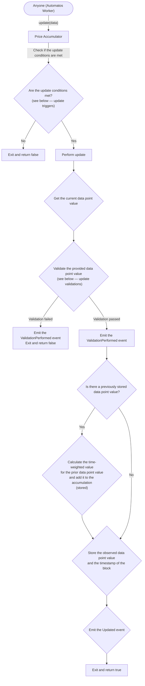

import { Cards, Callout } from 'nextra/components';
import { GitHubIcon } from '@components/icons';

# Price Accumulator Oracle

<Cards>
  <Cards.Card
    icon={<GitHubIcon />}
    title="Contract"
    href="https://github.com/adrastia-oracle/adrastia-core/blob/main/contracts/accumulators/PriceAccumulator.sol"
    target="_blank"
  />
</Cards>

## Purpose

Price accumulators are smart contracts that track single data points and stores them along with an accumulation of time-weighted data that can be used to calculate an average over a period of time. They were originally designed to track the price of an asset over time, hence the name, but can be used to track any data point that can be represented as a 112-bit unsigned integer.

Price accumulators typically track onchain data points, but they can be used to track offchain data as well.

## Functionality

Price accumulators are designed to provide two main functions:

1. Recording the current data point value
2. Recording the time-weighted value of the data point over time

The time-weighted value accumulation is used to calculate time-weighted averages of the data point value over a period of time. The logic for calculating the time-weighted value is determined by the hard-set [averaging strategy](/strategies/averaging). [TWA[P] oracles](/oracles/twap) provide the logic for calculating and storing these averages, utilizing the accumulator contract.

## Update flow

### Flowchart

The below flowchart is a simplified representation of the update flow for a price accumulator:



### Update data

The update data required can vary depending on the implementation contract, but it's typically composed of:

1. The address of the token whose data is being updated
2. An off-chain data point value to validate against the current data point value
3. A timestamp for the provided data point value

These data points are encoded as bytes and passed to the `update` function in the order specified above.

### Update triggers

All price accumulators require an update when either:

1. The current data point value deviates from the stored value by at least the `updateThreshold` value (expressed as a [normalized percent](/misc/update-thresholds)), or
2. The time since the last update is greater than or equal to the `updatePeriod`.

Note: Some contracts will make use of a `minUpdateDelay` to prevent updates from occurring too frequently as a means of limiting gas costs.

### Who can update the accumulator?

This is an abstract contract that does not specify who can update the accumulator. The implementation contract can define the access control logic for the `update` function.

As a rule of thumb, if the updater can influence the data point value, the update function should be restricted to a set of trusted sources. If the data point value is sourced from a secured external oracle, the update function may be open to anyone.

## Security mechanisms

### Updater restrictions

#### Access control

As mentioned above, the implementation contract should define access control logic for the `update` function if the updater can influence the data point value. This is to prevent malicious actors from manipulating the data point value to their advantage.

#### EOA requirement

As extra assurance, there is a standard requirement that the updater is an externally owned account (EOA). This ensures that malicious actors cannot use a contract to perform various attacks, such as flash-loan attacks, to manipulate the data point value.

Note that this requirement does not mitigate all attacks, such as sandwich attacks. But it's easier to acquire funds for a flash-loan attack than a sandwich attack, so this requirement increases the capital costs for an attacker.

<Callout emoji="🚨">This technique may soon become obselete in its current form.</Callout>

However, the implementation of this technique may soon become obsolete in its current form due to proposed changes to the handling of EOAs and `tx.origin` as proposed in a variety of EIPs such as [EIP-3074](https://eips.ethereum.org/EIPS/eip-3074) and [EIP-7702](https://eips.ethereum.org/EIPS/eip-7702).

Rest assured that implementing strict access control protects against the attack vector this requirement addresses. But without the EOA requirement, greater trust is required of the updater set.

### Update validations

#### Data point value validations

This abstract contract provides functionality that allows the updater to provide off-chain data point values to the accumulator. These provided values are compared to the current data point value to ensure they are within a certain threshold of each other. If the provided value deviates from the current value by at least half of the `updateThreshold`, the accumulator will reject the update.

This validation is necessary to limit the impact or possibility of a variety attacks including sandwich attacks, flash-loan attacks, and more.

Implementation contracts can override the `validateObservationAllowedChange` function to change the threshold.

#### Time-based validations

The above data point value validation is only meaningful if the provided data is recent. Timestamps must be provided with the update data for the accumulator to perform this validation. By default, the accumulator will reject updates where either:

1. The provided timestamp is older than 5 minutes from the current block timestamp, or
2. The provided timestamp is newer than the current block timestamp by more than 10 seconds (to allow for some clock drift)

Implementation contracts can override the `validateAllowedTimeDifference` function to change the maximum age of the provided data.

## Limitations

These contracts have two primary limitations:

1. Data points must fit in a 112-bit unsigned integer
2. Time-weighted values accumulate in a 224-bit unsigned integer

The first limitation is trivial, but the second limitation requires careful consideration. The accumulation (`cumulativePrice`) is designed to allow overflow, but too much overflow can lead to inaccuracies in the time-weighted average calculation. The point where the overflow becomes problematic depends on a few factors:

- The averaging strategy used
- The maximum value of the data point
- The measurement period (the time between two accumulations when calculating the average)

With 224-bits of space, the accumulator supports up to `2^224 - 1` units of overflow, allowing for a maximum accumulation of `2^224 - 1` units of weighted data point value.

Let's consider a variety of averaging strategies and how they affect the maximum safe measurement period.

We also look at any applicable minimums. Note that since Solidity does not support floating-point arithmetic, small values may result in imprecise calculations. Also note that at least 1 second must pass between two accumulations.

### Arithmetic average

#### Maximum measurement period

The formula to calculate the maximum safe measurement period for an arithmetic average is:

```
max_measurement_period = maximum_accumulation / maximum_data_point_value
max_measurement_period = (2^224 - 1) / (2^112 - 1)
max_measurement_period = 5e33
```

Price accumulators using the arithmetic average strategy can safely accumulate data points for over a billion years.

#### Minimums

The arithmetic averaging strategy has no minimums other than the requirement for time to have passed between two accumulations.

### Geometric average

#### Maximum measurement period

The formula to calculate the maximum safe measurement period for a geometric average is:

```
max_measurement_period = maximum_accumulation / ln(maximum_data_point_value)
max_measurement_period = (2^224 - 1) / ln(2^112 - 1)
max_measurement_period = 3e65
```

Price accumulators using the geometric average strategy can safely accumulate data points for over a billion years.

#### Minimums

Since the geometric average uses the natural logarithm of the data point value, the minimum data point value is 1. This is because the natural logarithm of 0 is undefined. If a value of 0 is provided, the averaging strategy will substitute 1 for the data point value.

### Harmonic average

As the harmonic average uses the reciprocal of the data point value, the formula for computing maximums and minimums is quite different. Since Solidity does not support floating-point arithmetic, weight (time) bit shifting is used to store the reciprocals and reverse shifting is used to calculate the average.

Due to the increased complexity of the harmonic average, and since Adrastia does not officially use the harmonic average with price accumulators, we will not provide a detailed analysis of the maximums and minimums for this strategy.
