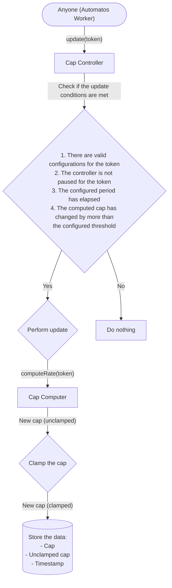
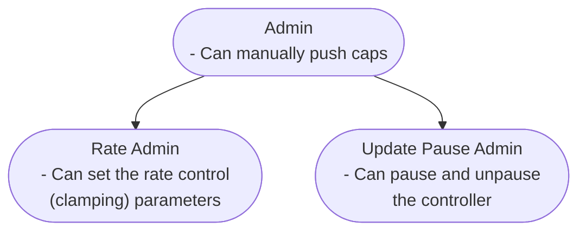
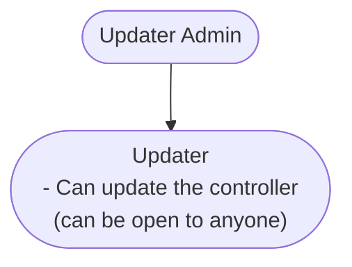

import { Callout } from 'nextra/components';
import { Cards } from 'nextra/components';
import { GitHubIcon } from '@components/icons';

# Cap Controller

<Cards>
  <Cards.Card
    icon={<GitHubIcon />}
    title="Base Contract"
    href="https://github.com/adrastia-oracle/adrastia-periphery/blob/main/contracts/rates/controllers/CapController.sol"
    target="_blank"
  />
  <Cards.Card
    icon={<GitHubIcon />}
    title="Managed Contract"
    href="https://github.com/adrastia-oracle/adrastia-periphery/blob/main/contracts/rates/controllers/ManagedCapController.sol"
    target="_blank"
  />
</Cards>

## Purpose

Supply and borrow cap controllers limit the collateralization and borrowing of assets, managing the risk that lenders face. These controllers set limits on the total assets supplied or borrowed and regulate the rate of market growth.

By setting these caps, the controllers ensure that risk exposure to individual assets is contained. This containment is crucial for maintaining the stability of the lending protocol and preventing overexposure to any single asset.

Additionally, by regulating market growth rates, cap controllers ensure sustainable protocol growth and effective risk management. This controlled growth allows risk managers to monitor and adjust protocol parameters, maintaining stability and security. This includes protection from sudden market fluctuations and technical risks, such as oracle manipulation, where attackers might manipulate asset prices to borrow excessively. Tight restrictions on market growth help mitigate these risks and protect the protocol from potential attacks.

## Motivation

Most lending protocols today utilize simple supply and borrow cap logic to limit the total assets supplied or borrowed. While these cap models generally perform well, they require manual adjustments to the cap parameters to achieve the desired risk exposure levels for the protocol. This manual intervention can be time-consuming and prone to human error, leading to inefficiencies and potential instability in the market.

By automating this process, cap controllers provide a transparent and stable way to manage risk exposure and market growth. These controllers continuously adjust the supply and borrow caps to maintain the desired risk exposure levels without the need for constant manual input. This automation enhances the protocol's efficiency and stability, ensuring a more reliable and responsive system for users.

## Components

### Cap Controller

The [Cap Controller](https://github.com/adrastia-oracle/adrastia-periphery/blob/main/contracts/rates/controllers/CapController.sol) is an extension of the standard [Prudentia rate controller](https://github.com/adrastia-oracle/adrastia-periphery/blob/main/contracts/rates/RateController.sol) that provides the logic to read the cap from the Cap Computer, clamp it based on the configured parameters, and store the data.

### Cap Computer

Cap Computers provide the logic to compute the cap before it is clamped by the Cap Controller. The suggested computer is the [Oracle Mutation Computer](../computers/oracle-mutation-computer) that reads the total supply or borrow balance for a market from an oracle and computes the cap based on a simple formula: `total * scalar + offset`.

## Update flow

### High-level overview

The following chart shows a simplified version of the update flow for an Adrastia Prudentia Cap Controller.

### Clamping logic

Caps are clamped based on the following parameters:

- Minimum cap
- Maximum cap
- Maxiumum increase per update (absolute, relative, or both)
- Maximum decrease per update (absolute, relative, or both)

Notes:

1. If a cap is being computed for a first time, clamping based on the maximum increase and decrease per update is not applied.
2. If the last cap is zero, clamping based on the maximum relative increase per update is not applied.
3. If the last cap is outside of the range of [min, max], clamping based on the maximum change per update is applied, thus temporarily ignoring the configured min and max. This allows the configured min and max to be changed without causing a sudden change in the cap. If a sudden change is desired, the cap can be manually adjusted.
4. In either direction (increase or decrease), the cap is clamped based on the more restrictive of the absolute and relative limits.

## Permissions

The cap controller is permissioned to allow for configuration changes, updater (reporter) restriction management, and more. The web app conveniently displays the permissioning of each cap controller, allowing you to easily see who has the ability to make changes to the controller. Simply click on the "Learn More" button on the controller card to view the permissions.

The standard cap Controller uses OpenZeppelin's [AccessControlEnumerable](https://docs.openzeppelin.com/contracts/4.x/api/access#AccessControlEnumerable) for permissioning with the following roles:

Note that all roles can manage the roles below them. Roles without a role above them are able to manage themselves.

## Configuration

<Callout emoji="🚧">This section is under construction.</Callout>

## Integration

<Callout emoji="🚧">This section is under construction.</Callout>
