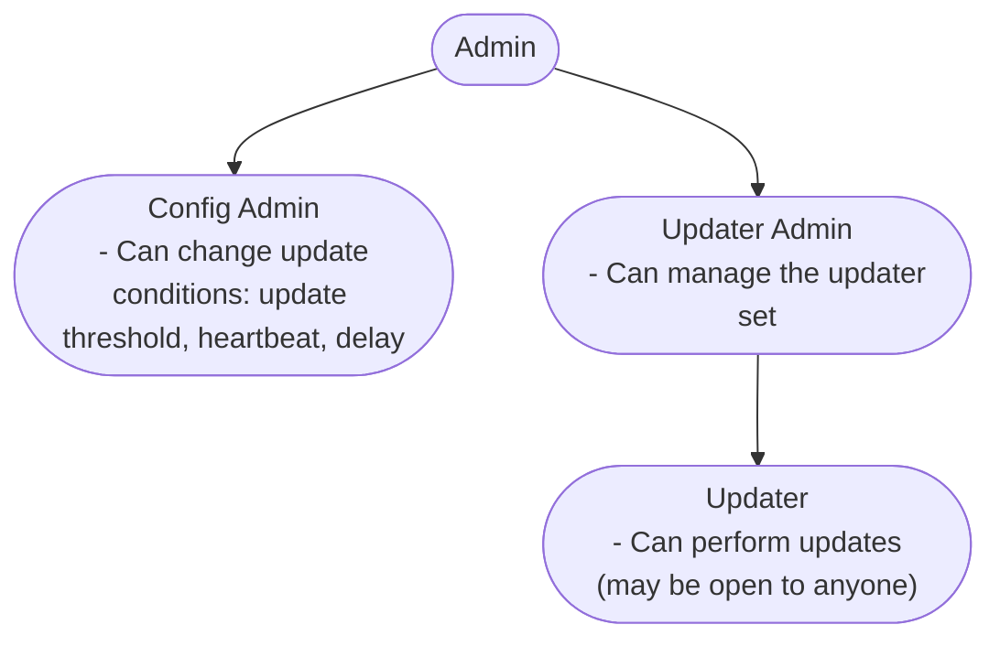

import { Cards, Card, Callout } from 'nextra/components';
import { GitHubIcon } from '@components/icons';

# SAV Price Accumulator

<Cards>
  <Card
    icon={<GitHubIcon />}
    title="Base Contract"
    href="https://github.com/adrastia-oracle/adrastia-core/blob/main/contracts/accumulators/proto/erc4626/SAVPriceAccumulator.sol"
    target="_blank"
  />
  <Card
    icon={<GitHubIcon />}
    title="Managed Contract"
    href="https://github.com/adrastia-oracle/adrastia-periphery/blob/development/contracts/accumulators/proto/erc4626/ManagedSAVPriceAccumulator.sol"
    target="_blank"
  />
</Cards>

## Purpose

The Single Asset Vault (SAV) Price Accumulator oracle is an extension of [`PriceAccumulator`](/contracts/oracles/accumulators/price) that tracks the price of ERC4626 vaults.

## Functionality

The functionality of the SAV Price Accumulator is identical to the [`PriceAccumulator`](/contracts/oracles/accumulators/price) oracle, with the exception that implements `fetchPrice` to track the price of ERC4626 vault share tokens.

This oracle relies on an external oracle (`underlyingAssetOracle`) to provide the price of the underlying asset of the vault. This oracle reads the vault's total asset balance (`totalAssets`), multiplies this by the price of the underlying asset, then divides the total value of the vault by the vault's total supply (`totalSupply`) to calculate the price per share.

## Permissions

Like most of our contracts, it's recommended to use the managed version of the SAV Price Accumulator to manage the configuration and permissions of the contract.

The standard managed contract uses OpenZeppelin's [AccessControlEnumerable](https://docs.openzeppelin.com/contracts/4.x/api/access#AccessControlEnumerable) for permissioning with the following roles:

Note that all roles can manage the roles below them. Roles without a role above them are able to manage themselves.
