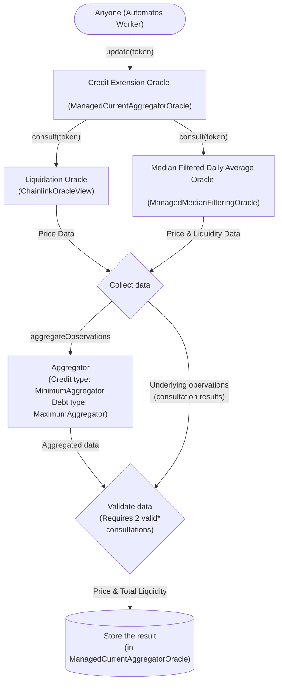

import { Callout } from 'nextra/components';

# Credit Extension Oracle

## Purpose

Credit Extension Oracles (CEOs) are purpose-built for lending protocols to extend credit — **slowly**. By aggregating a liquidation oracle and a median filtered daily average oracle, CEOs can be used to extend credit to a borrower in a way that is safe for the protocol. Price movements have to be sustained for a period of time (typically days) before the CEO will extend credit at the new price.

Rather than using one feed to determine the price for both credit extension and liquidation, we offer a split oracle design. This allows us to use a more aggressive oracle for liquidation, while using more conservative oracles for credit extension.

<Callout emoji="🧿">Principle: extend credit slowly and liquidate quickly.</Callout>

## Motivation

The motivation for Credit Extension Oracles is to provide a more robust and reliable oracle system for lending protocols. The current reliance on real-time price feeds for both credit extension and liquidation is a significant vulnerability for lending protocols. This vulnerability is exemplified by the exploit of Mango Markets, which led to the loss of over $100 million.

### Case study: Mango Markets hack

**Background of the attack:**

The need for robust and reliable oracles in lending protocols is exemplified by the case study of the Mango Markets hack. In this incident, the exploitation of the Solana-based lending and trading platform led to the theft of over $100 million. The attacker manipulated the price of the MNGO token by creating an abnormally large long position after depositing significant funds. This manipulation inflated the token's price by nearly 1000% in a short time, allowing the attacker to borrow heavily against this artificially inflated collateral, leading to massive losses for the protocol​.

**The issue:**

Mango Markets relied on a single price feed to determine both the extension of credit and the liquidation of assets. This approach made the system vulnerable to rapid and manipulative price fluctuations.

**How Credit Extension Oracles could have helped:**

Credit Extension Oracles, with their split oracle design, could have significantly mitigated the risks encountered by Mango Markets. The CEO approach distinguishes between the oracles used for liquidation (more aggressive and responsive to price changes) and those used for extending credit (more conservative and requiring sustained price movements). In the Mango Markets scenario, a CEO could have:

- **Slowed down credit extension**: By using a median filtered daily average oracle, the CEO would delay recognizing the artificially inflated price of the MNGO token. This delay means credit would not be extended based on these temporary, manipulated price spikes.

- **Maintained effective liquidation protocols**: The aggressive liquidation oracle would still respond quickly to changes in existing positions, protecting the protocol from under-collateralized loans due to genuine market downturns.

<Callout emoji="💡">
  Case study insight: The Mango Markets hack demonstrates the vulnerability of lending protocols to
  price manipulation. The Credit Extension Oracle's split design, separating the mechanisms for
  credit extension and liquidation, offers a resilient alternative that could prevent similar
  exploits in the future.
</Callout>

### Conclusion

The case study of Mango Markets demonstrates the vulnerability of lending protocols to price manipulation. The Credit Extension Oracle's split design, separating the mechanisms for credit extension and liquidation, offers a resilient alternative that could prevent similar exploits in the future.

While the use of CEOs in a split oracle design is not a silver bullet, it is a significant improvement over the current reliance on real-time price feeds for both credit extension and liquidation. The CEO approach distinguishes between the oracles used for liquidation (more aggressive and responsive to price changes) and those used for extending credit (more conservative and requiring sustained price movements). This approach would have significantly mitigated the risks encountered by Mango Markets.

## Types

There are two types of Credit Extension Oracles: collateral and credit. The difference between the two is how they handle price movements through the use of different aggregation strategies.

### Collateral

Collateral Credit Extension Oracles are used to determine the value of a borrower's collateral. This type of CEO delays and limits upward price movements to protect the protocol from overvaluing collateral. Downwards price movements are not delayed.

This type of CEO uses the `MinimumAggregator` to aggregate the results of the two oracles. This aggregation strategy will return the lesser price reported by the two underlying oracles.

### Debt

Debt Credit Extension Oracles are used to determine the value of a borrower's debt. This type of CEO delays and limits downward price movements to protect the protocol from undervaluing debt. Upward price movements are not delayed.

This type of CEO uses the `MaximumAggregator` to aggregate the results of the two oracles. This aggregation strategy will return the greater price reported by the two underlying oracles.

## Update flow

The following chart shows a simplified version of the update flow for a Credit Extension Oracle.



\* Underlying oracle consultations are considered valid if the age of their data is less than the `heartbeat` value of the Credit Extension Oracle plus some delay tolerance (typically thirty minutes).

### Update triggers

The Credit Extension Oracle is updated when either:

1. The current price deviates from the stored price by more than the `updateThreshold` value.
2. The time since the last update is greater than the `heartbeat` value.

### Who can update the oracle?

Provided that updates are not paused (by the admin) and the update trigger conditions are met, anyone can update the oracle. This is safe because the underlying oracles have their own security mechanisms and updation processes to provide safe and accurate data. The only thing that the Credit Extension Oracle does is aggregate the data from the underlying oracles and store the result.

## Integration

### Requirements

First and foremost, the Credit Extension Oracle design requires integrating protocols to make use of at least three different oracles:

1. A liquidation oracle (e.g., Chainlink)

- This oracle is used when petforming liquidations to value a borrower's collateral as well as debts. It should be aggressive and responsive to price changes to prevent under-collateralized loans that can lead to bad debt.

2. A Credit Extension Oracle of the collateral type

- This oracle is used when extending credit to value a borrower's collateral. It should be conservative and slow to respond to upwards price changes to prevent overvaluing collateral.

3. A Credit Extension Oracle of the debt type

- This oracle is used when extending credit to value a borrower's debt. It should be conservative and slow to respond to downwards price changes to prevent undervaluing debt.

### Integration steps

The following steps are required to integrate a Credit Extension Oracle into a lending protocol:

1. Find liquidation oracles and Credit Extension Oracles of the collateral and debt types that meet the protocol's needs.

- Addresses of our CEOs can be found via our [app](https://adrastia.io/app/).
- Important aspects to consider when choosing oracles are:
  - Update frequency (thresholds and heartbeat)
  - Past performance (e.g., uptime and accuracy)
  - Cost
  - Duration - in the case of CEOs, the duration of the median filter and the duration of the time-weighted averages (TWAs)
    - Shorter durations will extend credit more quickly but will also be more susceptible to price manipulation and short term volatility.
    - Longer durations will extend credit more slowly which is safer but can deter borrowers that like to quickly take advantage of price movements.
- If such oracles do not exist, or you'd like oracles with different configurations, kindly reach out to us via Discord or Twitter.

2. Configure your protocol to use the liquidation oracle for liquidations and the Credit Extension Oracles for credit extension.

### Integration code

Our [`IPriceOracle`](https://github.com/adrastia-oracle/adrastia-core/blob/main/contracts/interfaces/IPriceOracle.sol) interface should be used to integrate the Credit Extension Oracle into your protocol. If you'd like to use Chainlink's `AggregatorV3Interface` instead, you are free to deploy our [`AdrastiaPoweredPriceOracle`](https://github.com/adrastia-oracle/adrastia-periphery/blob/development/contracts/compatibility/AdrastiaPoweredPriceOracle.sol) contract that wraps the Credit Extension Oracle to provide the same interface as Chainlink's. See below for deployment instructions.

#### Reading from IPriceOracle

For convenience, here's a simplified version of the `IPriceOracle` interface that only includes the functions required to read prices from the Credit Extension Oracle.

```solidity
interface IPriceOracle {
    /**
     * @notice Gets the price of a token in terms of the quote token.
     * @param token The token to get the price of.
     * @return price The quote token denominated price for a whole token.
     */
    function consultPrice(address token) external view returns (uint112 price);

    /**
     * @notice Gets the price of a token in terms of the quote token, reverting if the quotation is older than the
     *  maximum allowable age.
     * @param token The token to get the price of.
     * @param maxAge The maximum age of the quotation, in seconds. If 0, the function gets the instant rates as of the
     *   latest block, straight from the source.
     * @return price The quote token denominated price for a whole token.
     */
    function consultPrice(address token, uint256 maxAge) external view returns (uint112 price);

    /**
     * @notice Gets the number of decimal places that quote prices have.
     * @return The number of decimals of the quote token (or currency) that quote prices have.
     */
    function quoteTokenDecimals() external view returns (uint8);
}
```

There are two functions for reading prices from the Credit Extension Oracle:

1. `consultPrice(address token)` - This function returns the latest stored price for the given token, ignoring the age of the price.
2. `consultPrice(address token, uint256 maxAge)` - This function returns the latest stored price for the given token, but reverts if the price is older than the given `maxAge` value. _A value of `0` can be used for `maxAge` to bypass the stored price and get the latest price from the underlying oracles, but this may not always be safe and we don't recommend it._

#### Deploying and reading from AdrastiaPoweredPriceOracle

If you'd like to use Chainlink's `AggregatorV3Interface` instead of our `IPriceOracle` interface, you can deploy our [`AdrastiaPoweredPriceOracle`](https://github.com/adrastia-oracle/adrastia-periphery/blob/development/contracts/compatibility/AdrastiaPoweredPriceOracle.sol) contract that wraps the Credit Extension Oracle to provide the same interface as Chainlink's.

The constructor takes four arguments:

1. `IPriceOracle adrastiaOracle_` - The address of the Credit Extension Oracle.
2. `address token_` - The address of the token that the Credit Extension Oracle is configured to return prices for.
3. `uint8 decimals_` - The number of decimals that the Credit Extension Oracle is configured to return prices with.
4. `string memory description_` - (Optional) A description of the price feed.

Once deployed, you can use the `latestRoundData()` function to read the latest price from the Credit Extension Oracle. The `decimals()` function can be used to read the number of decimals that the Credit Extension Oracle is configured to return prices with.

### Final remarks

It's important to verify that the value returned by `quoteTokenDecimals()` (with the `IPriceOracle` interface) and/or `decimals()` (with the `AggregatorV3Interface` interface) is what your protocol expects. If not, you'll need to adjust the price returned by the oracle accordingly. You'll further want to verify that the quote token decimals (as well as the quote token itself) are the same for all of the oracles you're using.

Finally, we recommend speaking to us on Discord or Twitter before integrating the Credit Extension Oracle into your protocol. We're happy to help and can provide guidance on the best way to integrate the oracle into your protocol. If we know that you're using the oracle, we can also notify you of any updates or changes that may affect your integration.
