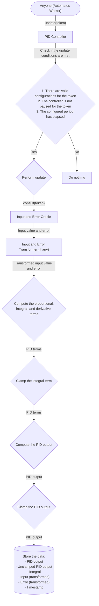
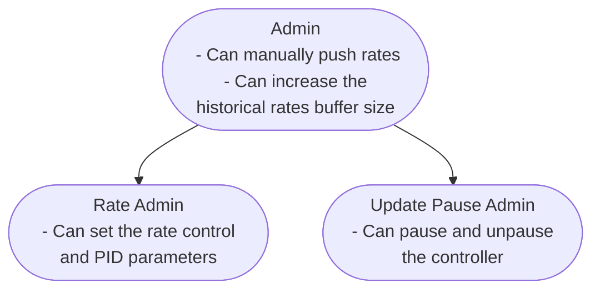
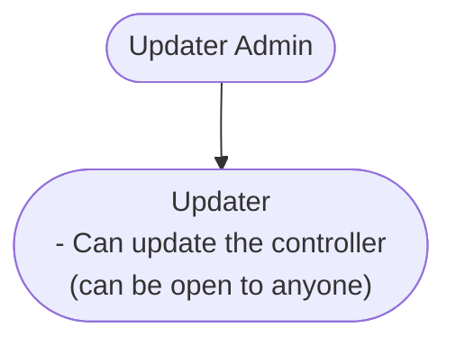

import { Callout } from 'nextra/components';

# PID Controller

## Purpose

A [Proportional-Integral-Derivative (PID) controller](https://en.wikipedia.org/wiki/Proportional%E2%80%93integral%E2%80%93derivative_controller) is a control loop mechanism widely used in industrial control systems and various applications requiring continuously modulated control. The PID controller continuously calculates an error value as the difference between a desired setpoint and a measured process variable. It applies a correction based on proportional, integral, and derivative terms, hence the name. The proportional term produces an output value proportional to the current error, the integral term accounts for past errors to eliminate residual steady-state error, and the derivative term predicts future error based on its rate of change, providing a balanced and accurate control system.

In the context of DeFi, the PID controller system is designed to automatically adjust interest rates to find the market equilibrium and achieve an admin-specified target utilization rate. By continuously monitoring and adjusting the interest rates, the PID controller ensures that the utilization rate of the lending platform remains consistently close to the desired target. This dynamic adjustment mechanism helps maintain a stable and efficient market, reducing the need for manual intervention and ensuring high capital efficiency of the DeFi platform.

## Motivation

Most lending protocols today rely on utilization-based linear curve formulas with kinks past the optimal utilization level. While these interest rate models generally perform well, they require manual adjustments to the slope parameters to achieve market equilibrium interest rates that meet the protocol's target utilization for a market. This manual intervention can be time-consuming and prone to human error, leading to inefficiencies and potential instability in the market. PID controllers automate this process in a transparent and stable way, continuously adjusting interest rates to maintain the desired utilization rate without the need for constant manual input. This automation enhances the protocol's efficiency and stability, ensuring a more reliable and responsive system for users.

## Components

### PID Controller

The [PID controller](https://github.com/adrastia-oracle/adrastia-periphery/blob/main/contracts/rates/controllers/PidController.sol) is an extension of the standard [Prudentia rate controller](https://github.com/adrastia-oracle/adrastia-periphery/blob/main/contracts/rates/RateController.sol) that includes the logic to perform the PID calculus.

The PID controller has the following functionality and characteristics:

- Proportional on either measurement or error (configurable)
- Integral on error
- Derivative on either measurement or error (configurable)
- Input and error values can be transformed before being passed to the PID controller
- Integral term can be clamped to prevent windup and overshooting
- Output rates are limited to the range [0, 2^64)
- Unpausing kickback prevention
- Manual rate adjustment kickback prevention
- Updates occur continuously over a fixed period

### Input and Error Oracle

The Input and Error Oracle is a contract that provides the input value and error to the PID controller.

In the context of DeFi lending interest rates, the input value is the current utilization rate of the lending platform, and the error is the difference between the current utilization rate and the target utilization rate set by the admin.

### Input and Error Transformer

The Input and Error Transformer is an optional contract that transforms the input value and error before passing them to the PID controller. This transformation can be used to adjust the input data to better fit the PID controller's requirements.

Transformers are useful in scenarios where the input data needs to be normalized or adjusted to improve the PID controller's performance.

For instance, if a lending protocol targets 90% utilization, the range of error is roughly [-10%, 90%], creating an imbalance. Without a transformer, the controller would be too sensitive to utilization decreases (below target) and not sensitive enough to utilization increases (above target). A transformer can be used to increase sensitivity to utilization increases and decrease sensitivity to utilization decreases, creating a more balanced control system.

## Update flow

The following chart shows a simplified version of the update flow for an Adrastia Prudentia PID Controller.

## Permissions

The PID controller is permissioned to allow for configuration changes, updater (reporter) restriction management, and more. The web app conveniently displays the permissioning of each PID controller, allowing you to easily see who has the ability to make changes to the controller. Simply click on the "Learn More" button on the controller card to view the permissions.

The standard PID Controller uses OpenZeppelin's [AccessControlEnumerable](https://docs.openzeppelin.com/contracts/4.x/api/access#AccessControlEnumerable) for permissioning with the following roles:

Note that all roles can manage the roles below them. Roles without a role above them are able to manage themselves.

## Configuration

<Callout emoji="🚧">This section is under construction.</Callout>

## Integration

<Callout emoji="🚧">This section is under construction.</Callout>
